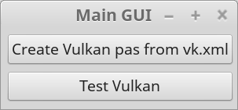
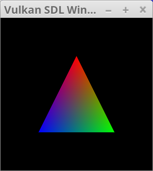

Vulkan Library for FreePascal
==============
Copyright (c) 2017 by James McJohnson

Screenshots
--------------
  

Test Program:  
  

About
--------------
The vk.xml file is provided as a "critically important and normative part of the Vulkan Specification" and maintained as a part of Vulkan-Docs at [https://github.com/KhronosGroup/Vulkan-Docs/blob/1.0/src/spec/vk.xml](https://github.com/KhronosGroup/Vulkan-Docs/blob/1.0/src/spec/vk.xml).

This program endeavours to take the vk.xml file and create a FreePascal library which provides a Vulkan interface for FreePascal/Lazarus.

This library is submitted in the hopes that it might be useful to someone, and also that better programmers can extend this to be a truly useful library for FreePascal.

Library File Structure
--------------

* **vulkan.pas**: Not dynamically generated. Contains higher level library wrapper classes.

The following are created from vk.xml and are inserted into **vulkan.pas** at the appropriate places.

* **vulkan\_constants\_and\_types.inc**
* **vulkan\_functionvariables.inc**
* **vulkan\_functionassignments.inc**
* **vulkan\_dbgclass\_type.inc**
* **vulkan\_dbgclass\_implementation.inc**
* **vulkan\_headerinitialization.inc**

Dependencies
--------------

Only the latest copy of [**vk.xml**](https://github.com/KhronosGroup/Vulkan-Docs/blob/1.0/src/spec/vk.xml) is required to create the 6 include files.

To test and use vulkan.pas, it is required to have:

  * [**SDL library**](https://www.libsdl.org/): Currently needed for initial window generation and input/output functionality
  * [**Pascal-SDL-2-Headers**](https://github.com/ev1313/Pascal-SDL-2-Headers): Currently needed to access SDL2 library from FreePascal
  * [**bgrabitmap**](https://github.com/bgrabitmap/bgrabitmap): Currently needed for general image manipulation
  * [**Vulkan installation**](https://www.khronos.org/vulkan/)

FPC/Lazarus Vulkan Library Philosophy
--------------
It is the philosophy of this library to maintain wrapper classes in a one-to-one relationship as close to the vulkan specification as possible.

Native Vulkan types are renamed with a 'T' prefix, but function and procedure calls are not renamed. (e.g. vkImage -> TvkImage, but vkCreateImage -> vkCreateImage (a function of type TvkCreateImage))

Higher level wrapper library types are named with a "Tvk\_" prefix. (e.g. TvkImage is low level internal use, but Tvk\_Image is the higher level encapsulation).

License
--------------
Vulkan Library for FreePascal is released under a modified MIT license, see [LICENSE.md](LICENSE.md) for full text.

Public Service Announcement
--------------

  "For I am not ashamed of the Good News of Christ, for it is the power of God for salvation for everyone who believes..." - _Romans 1:16_   
  "For God so loved the world, that He gave His only begotten Son, that whosoever believeth in Him should not perish, but have everlasting life." - _John 3:16_

* **Hear**: "So faith comes by hearing, and hearing by the word of God." - _Romans 10:17_
* **Believe**: "...for unless you believe that I am He, you will die in your sins." - _John 8:24_
* **Repent**: "The times of ignorance therefore God overlooked. But now He commands that all people everywhere should repent, because He has appointed a day in which He will judge the world in righteousness by the Man Whom He has ordained; of which He has given assurance to all men, in that He has raised Him from the dead.” - _Acts 17:30-31_
* **Confess**: "Everyone therefore who confesses Me before men, him I will also confess before My Father Who is in heaven. But whoever denies Me before men, him I will also deny before My Father Who is in heaven." - _Matthew 10:32-33_
* **Be Baptized**: "Go, and make disciples of all nations, baptizing them in the name of the Father and of the Son and of the Holy Spirit" - _Matthew 28:19_
